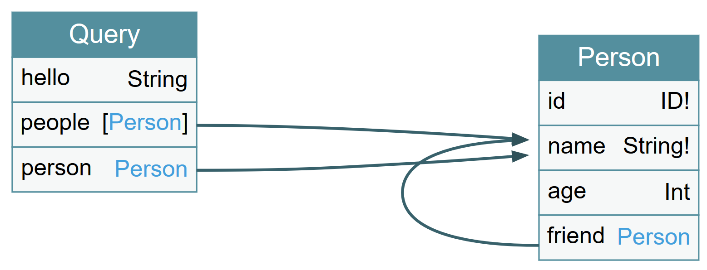

# Simple GraphQL server

GraphQL server using express.js

_Please not that this is only basic implementation._

Schema is following:



## Setup & Run

```
npm install
npm start
```

Open `http://localhost/graphql`

## Queries

Say Hello:

```
{
  hello
}
```

Get person by id:

```
{
  person(id: 2) {
    id
    name
  }
}
```

Get people:

```
{
  people {
    name
    age
  }
}
```

```
mutation {
  createPerson(name: "Juraj", age: 35) {
    id
    name
  }
}
```
